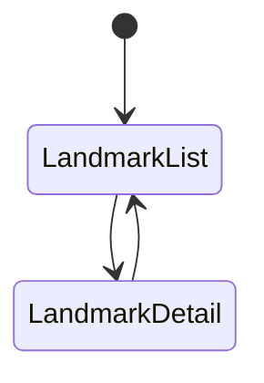
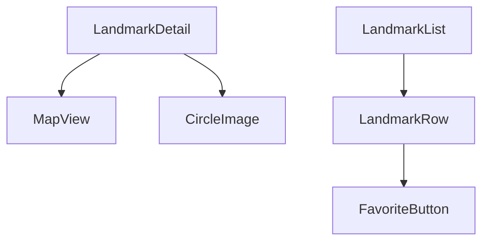
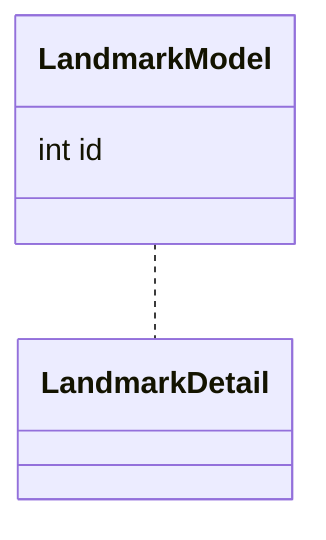

# 页面路由跳转

```mermaid
stateDiagram
	[*] --> LandmarkList
  LandmarkList --> LandmarkDetail
	LandmarkDetail --> LandmarkList
```

# 组件结构

```mermaid
graph TD;
    LandmarkDetail-->MapView;
    LandmarkDetail-->CircleImage;
    
    LandmarkList-->LandmarkRow;
    
    LandmarkRow-->FavoriteButton;
```

# Model

```mermaid
classDiagram
	LandmarkModel .. LandmarkDetail
	LandmarkModel : int id
```
